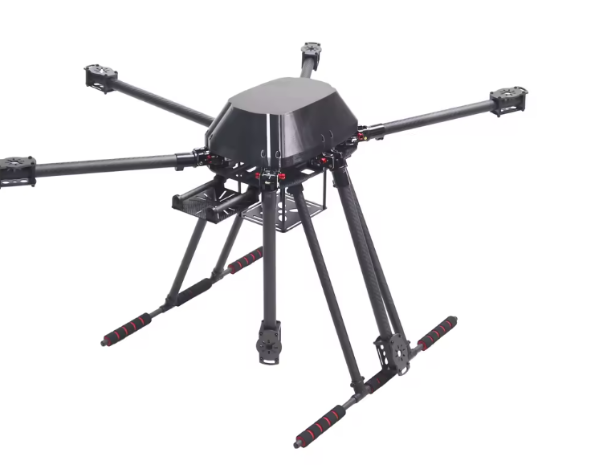
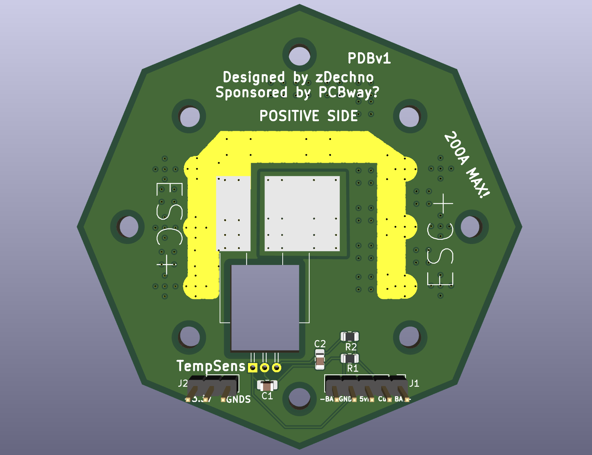
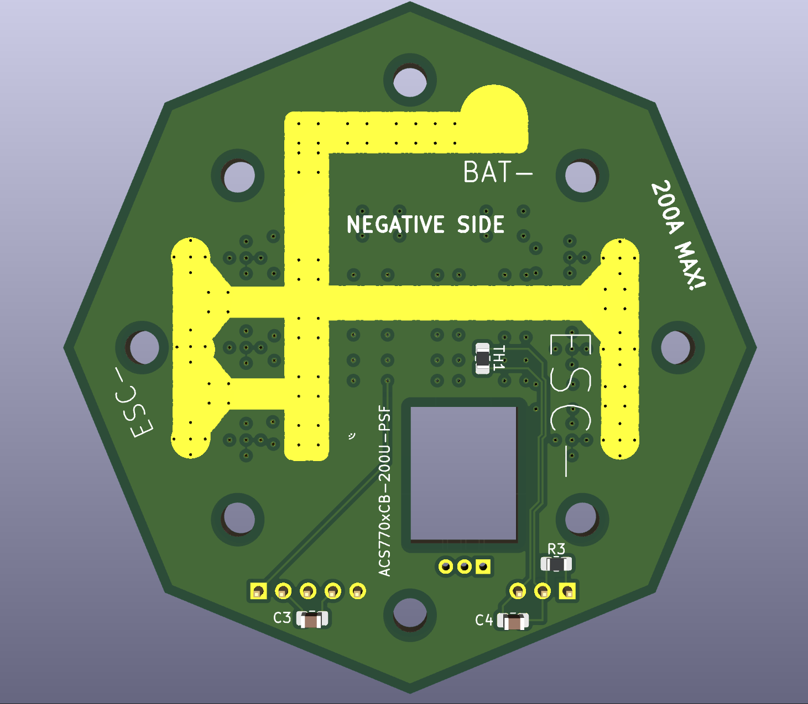

# TSP-1X — Thermal Sensor Platform

A 16-inch hexacopter built as a stable, large-scale platform for testing sensors 
and autonomous flight systems. The first real-world application: using a thermal 
imaging camera to locate fawns hiding in tall grass before agricultural mowers 
put them at risk — with autonomous, AI-based detection (via Jetson Nano/Orin) 
planned for a later stage.

**Status:** Early build phase — frame and remaining motors not yet acquired. 
Currently focused on the electronics, starting with a custom-designed 
Power Distribution Board (PDB).

## Frame

*ZD850 16" hexacopter frame*

## Power Distribution Board (PDB)

Custom-designed PCB that distributes power from the 6S Li-Ion battery to all 
6 ESCs. Includes:
- Hall-effect current sensing (ACS770xCB-200U-PSF)
- Onboard temperature sensor for thermal monitoring
- Gerber files ready — see `Gbr.zip`
- Full schematic and design documentation — see [`pdb.pdf`](pdb.pdf)

  
  

## Specs

- Frame: ZD850 (16")
- Motors: 6x Tarot 4114
- Power: 6S Li-Ion
- Current sensing: ACS770xCB-200U-PSF
- Custom PDB with integrated temperature sensing

## Roadmap

- [x] Frame & motor selection
- [x] PDB design (Gerbers ready)
- [ ] Electronics assembly
- [ ] Maiden flight
- [ ] Thermal camera integration
- [ ] Jetson Orin onboard object detection

## About Me

17-year-old high school student (Germany), building this as a long-term project 
to learn CAD, PCB design, and eventually autonomous systems — with the goal of 
helping farmers protect fawns during mowing season.

## Repo Contents

- `Gbr.zip` — Gerber files for the PDB
- `pdb.pdf` — PDB schematic / design documentation
- `EXTRAS.zip` — additional design files
